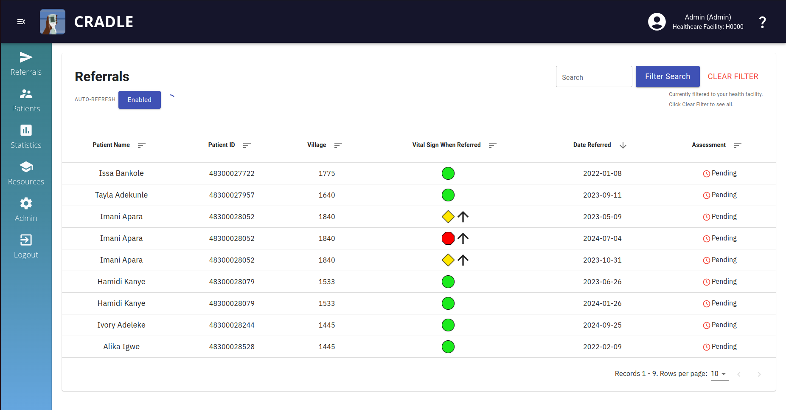

#  Cradle VSA System: React Front-End and Python (Flask) Back-End

React front-end web application and Python back-end web server for the Cradle 
VSA System, a technological health care system to improve maternal care and 
reduce preventable maternal deaths in Ugandan villages.

## Sites and Servers

* Issue tracking is managed via JIRA at: https://icradle.atlassian.net
* `master` is continuously deployed on: https://cmpt373-lockdown.cs.surrey.sfu.ca
* `prod` will be continuously deployed on a DigitalOcean / Vultr VPS in the future

## Setup Instructions

Please follow the setup instructions located in [docs/dev_env_setup.md](docs/dev_env_setup.md).

## Default Usernames & Passwords

When you `seed_minimal`, only one user is added:

| Username           | Password | Role                   |
|--------------------|----------|------------------------|
| admin123@admin.com | admin123 | ADMIN - Administrator  |

If you choose to seed additional test data using either `seed_test_data` or `seed`,
the previously mentioned admin user is added along with a few additional users:

| Username           | Password | Role                         |
|--------------------|----------|------------------------------|
| admin123@admin.com | admin123 | ADMIN - Administrator        |
| hcw@hcw.com        | hcw123   | HCW   - Healthcare Worker    |
| cho@cho.com        | cho123   | CHO   - Chief Health Officer |
| vht@vht.com        | vht123   | VHT   - Village Health Team  |
